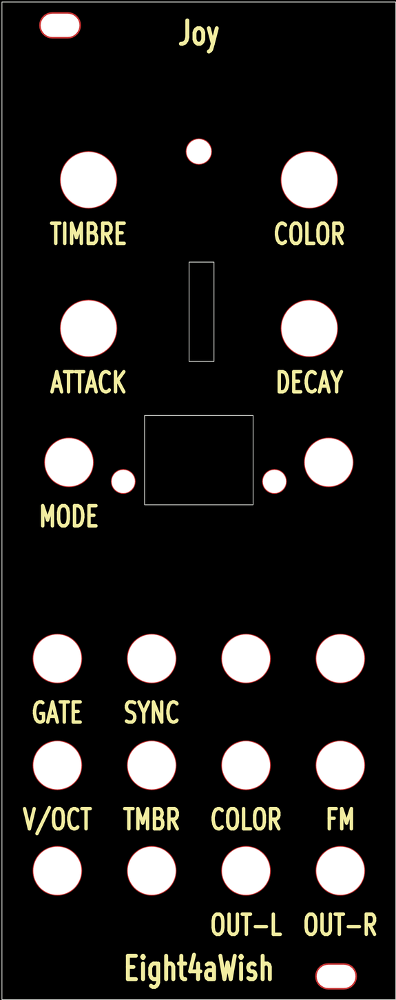
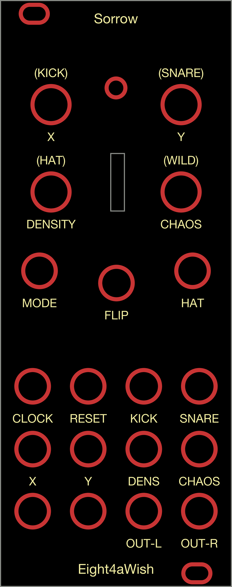
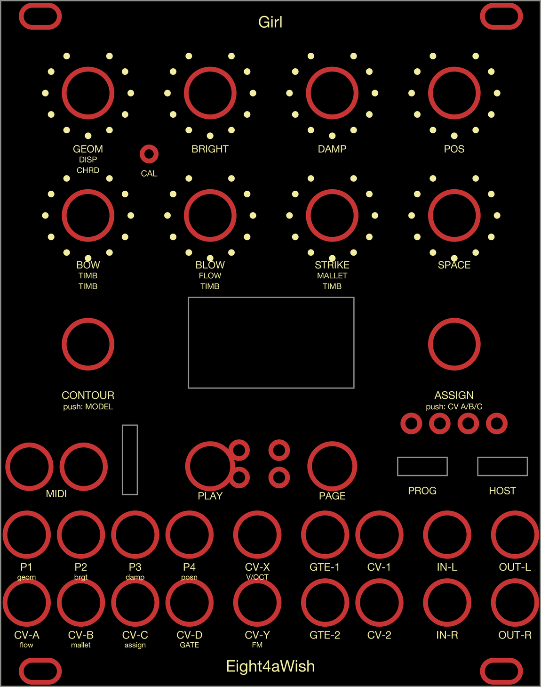

# PCB faceplates

The 3D-printed faceplates in [`../panels/`](../panels/) describe a set of holes,
cutouts and labels. That same description makes a perfectly good **PCB**
faceplate: black solder mask instead of black filament, white silkscreen instead
of white filament. This folder holds the KiCad projects and ready-to-upload
gerbers.

Generated by [`panels/kicad_faceplate.py`](../../panels/kicad_faceplate.py),
which reads the build123d panel script directly, so the PCB never drifts from
the printed panel.

| Folder | Module | Source script |
| --- | --- | --- |
| [`joy_10hp/`](joy_10hp/) | **Joy** — Braids macro-oscillator + 64×48 OLED, 10HP | [`panels/daisy_braids.py`](../../panels/daisy_braids.py) |
| [`sorrow_10hp/`](sorrow_10hp/) | **Sorrow** — Grids drum-pattern generator, 10HP | [`panels/daisy_grids.py`](../../panels/daisy_grids.py) |
| [`girl_20hp/`](girl_20hp/) | **Girl** — Elements on a Ksoloti Big Genes, 20HP | [`panels/ksoloti_biggenes.py`](../../panels/ksoloti_biggenes.py) |

| Joy | Sorrow | Girl |
| --- | --- | --- |
|  |  |  |

## Regenerating

```sh
python3 panels/kicad_faceplate.py panels/daisy_braids.py \
    --outdir exports/pcb/joy_10hp --name joy_10hp \
    --title "Joy 10HP faceplate" --gerbers

python3 panels/kicad_faceplate.py panels/daisy_grids.py \
    --outdir exports/pcb/sorrow_10hp --name sorrow_10hp \
    --title "Sorrow 10HP faceplate" --gerbers

python3 panels/kicad_faceplate.py panels/ksoloti_biggenes.py \
    --outdir exports/pcb/girl_20hp --name girl_20hp \
    --title "Girl 20HP faceplate" --gerbers
```

`kicad-cli` is not on `PATH` in a normal macOS install; it lives inside the app
bundle, so prefix the command with:

```sh
export PATH="/Applications/KiCad/KiCad.app/Contents/MacOS:$PATH"
```

### Two kinds of panel script

`joy_10hp` and `sorrow_10hp` come from Daisy Patch Init panels, which carry a
`HOLES` table in Electrosmith's own KiCad coordinates plus two parallel label
lists whose order has to be un-mirrored (see the module docstring).

`girl_20hp` comes from a hand-authored panel that instead carries a `LAYOUT`
dict — one entry per control, each with its own position, diameter and label.
The generator reads both. Two things it has to convert for `LAYOUT`:

- **Y is measured upward** from the bottom edge (a jack is low, a pot is high),
  where KiCad measures downward. `y_kicad = panel_h - y_layout`.
- **Slot and window positions are centres**, not corners.

A `LAYOUT` control with neither a diameter nor a width/height is reported and
skipped rather than guessed at, because a guessed hole in a fab file is worse
than a missing one.

`--gerbers` shells out to `kicad-cli` (KiCad 7 or newer) to plot the fab set and
zip it. Without `kicad-cli`, open the `.kicad_pcb` and use **File → Fabrication
Outputs → Gerbers…** and **Drill Files…** (Excellon, millimetres, absolute
origin, separate PTH/NPTH files).

The board is written in the KiCad 6/7 file format, which KiCad 7, 8 and 9 all
open directly. Run the script with `--help` for the text-size, brand-margin and
washer-pad options.

`preview.png` is the same board plotted flat — front copper, front silkscreen
and the outline, in KiCad's default theme colours (so the mask-free copper rings
come out red and the silkscreen pale yellow) on a black background:

```sh
kicad-cli pcb export svg --mode-single -o preview.svg \
    --layers F.Cu,F.SilkS,Edge.Cuts --page-size-mode 2 --exclude-drawing-sheet \
    exports/pcb/joy_10hp/joy_10hp.kicad_pcb
```

then rasterised over black at 575 px wide. **That is no longer how it works.**
`preview.png` is now drawn by the generator itself, from the same hole and label
tables the gerbers come from, so it cannot drift from what gets fabricated — and
it needs only PIL rather than a rasteriser. Pass `--no-preview` to skip it.

It is still a picture of the plot, not of the finished board: mask-free copper
rings red, silkscreen pale yellow, on black. The real panel is black mask with
white lettering.

## What's in the design

Taken verbatim from the printed panel (which in turn comes from Electrosmith's
`blank.kicad_pcb` front-panel file, kept in
[`reference/Daisy_Patch_Init/`](../../reference/Daisy_Patch_Init/)):

- **50.8 × 128.5 mm** (10HP, 3U) outline on `Edge.Cuts`.
- **21 drilled NPTH holes** — 14 × Ø6.2 (jacks + button), 4 × Ø7.2 (pots),
  1 × Ø3.2 (LED), 2 × Ø3.0 (OLED mounting).
- **2 routed 5 × 3 mm mounting slots**, top-left and bottom-right.
- **microSD slot**, 3.208 × 12.802 mm internal cutout.
- **OLED window**, 14 × 11.5 mm internal cutout, where the Patch Init's B8
  toggle switch used to be — the toggle has to come off for the screen to fit.
- **White silkscreen labels** on the front, matching the printed panel's
  wording and positions.
- A `JLCJLCJLCJLC` marker on the **back** silkscreen so JLCPCB stamps its order
  number there instead of on the visible face.

### Differences from the 3D-printed panel

- The printed panel's base is mirrored about X (`export_transform` in the panel
  scripts) while its labels are not, so on the print the SD slot sits ~0.6 mm
  off its true position and the mounting slots land on the opposite diagonal.
  The PCB uses Electrosmith's true, unmirrored coordinates; only the
  label-to-hole assignment is un-mirrored to compensate. The finished panel
  reads identically.
- The button hole (B7) is Ø6.2 here because that is what `daisy_braids.py`
  specifies. Electrosmith's own panel drills it Ø5.5, which is a snugger fit on
  a TL1105 bushing. Change the `HOLES` entry if you want the tighter hole.
- Silkscreen uses KiCad's stroke font, condensed to 72% width so `OUT-L` /
  `OUT-R` stay inside the 12.17 mm jack pitch — KiCad's stock font is much wider
  per glyph than the Arial Bold the print uses.

## Ordering from JLCPCB

Upload `joy_10hp/joy_10hp-gerbers.zip` and set:

| Option | Value | Why |
| --- | --- | --- |
| Base material | FR-4 | |
| Layers | 2 | 1-layer boards have their own (worse) mask/silk options |
| Dimensions | 50.8 × 128.5 mm | should be detected from `Edge.Cuts` |
| PCB thickness | **1.6 mm** | standard Eurorack panel thickness |
| PCB colour | **Black** (or your choice) | this *is* the panel colour |
| Silkscreen | **White** | the lettering |
| Surface finish | HASL lead-free, or ENIG | only the tiny washer rings are exposed |
| Remove order number | **Specify a location** | the `JLCJLCJLCJLC` marker puts it on the back |
| Gold fingers / castellated | No | |

The two internal cutouts are routed, so JLCPCB may add a small "special
process" line item. Their router leaves an inside-corner radius of roughly
0.5 mm, so the OLED window's corners come out slightly rounded — irrelevant with
the display sitting behind it.

There is essentially no copper on this board (just a 0.1 mm ring around each
hole, carried over from Electrosmith's design, which sits under the jack and pot
washers). That is fine to fabricate — it is exactly what the stock Patch Init
faceplate files do.

## Assembly notes

- Jack nuts tighten straight onto 1.6 mm FR-4; no washers needed beyond the ones
  supplied with the jacks.
- The OLED module mounts on the two Ø3.0 mm holes at (15.65, 61.75) and
  (35.15, 61.75), 19.5 mm apart, with M3 hardware or nylon standoffs.
- The Patch Init's **B8 toggle switch must be removed** before this panel will
  seat — see the [Joy firmware
  README](https://github.com/Eight4aWish/eurorack_daisy_patch_init/tree/main/daisy_braids_oled).

## Girl, and where its geometry came from

`girl_20hp` is a faceplate for the **Ksoloti Big Genes**, which is someone
else's board (Ksoloti, GPLv3). Until recently its panel CAD was not published,
so `panels/ksoloti_biggenes.py` was a photo reconstruction and the renders were
approximately right and precisely wrong — the jack rows were 1.2–1.7 mm out, the
middle band was 8 mm out, and every hole diameter came from a generic default
table rather than from the board.

It is now measured off `ksoloti_big_genes_panel-brd.svg`, a KiCad plot of the
real panel PCB **v0.8**. Checked both directions: 41 holes on the board, 41
controls in the `LAYOUT`, no mismatch in position or diameter, nothing on the
board left unplaced and nothing placed that is not on the board.

### Labels say what the module does, not what the board's pins are called

The first pass at `girl_20hp` reproduced the Big Genes' own pin names - P1 to P8
on the pots, CV-A to CV-D on the jacks. That documents the *board*. Girl is
Elements running on that board, so the panel now says GEOM / BRIGHT / DAMP / POS
and BOW / BLOW / STRIKE / SPACE, taken from
`eurorack_modules/docs/KSOLOTI_ELEMENTS.md`.

Both modules have controls whose function changes with a page, and a panel that
prints only the first state is documenting a fraction of the module:

| | pages | what changes |
| --- | --- | --- |
| **Girl** | 3, cycled by **S4** | P5-P7 are exciter *level*, then *meta* (Flow, Mallet), then *timbre*. P8 is Space in all three. |
| **Sorrow** | 2, cycled by a short press on **B7** | the four pots stop being X / Y / DENSITY / CHAOS and become the per-drum density trims plus **wildness**. |

Girl stacks its alternates under the primary name, smallest last. Sorrow puts its
one alternate above the pot in brackets, because the panel already has a label
below. Sorrow's omission was the worse of the two: the missing word was
**WILDNESS**, which is the control the module is named around.

Jacks carry both - the board's name in full size and Girl's use of it underneath
in lower case, since a Big Genes owner needs to find CV-A and a Girl player needs
to know it is Flow.

Two honest caveats:

- **The labels are still ours.** The real silkscreen is drawn as stroked
  outlines rather than as text, so it cannot be lifted mechanically. The jack
  wording below is our reading of what each one does.
- **The Ø1.7 hole at (27.92, 99.70)** is calibration access — a screwdriver hole
  for a trimmer on the board behind, labelled `CAL`. It is the one hole on the
  plot that is under 2 mm and still appears on every layer, which is what tells
  it apart from the silkscreen dots below.
- **The pot dial scales are silkscreen, not holes.** Eleven dots per pot, 30°
  apart on an r=8 circle, with the bottom 60° left out because that is the dead
  zone of a 300° pot: 88 in total. They appear on the plot's silkscreen layer
  *only*, and at Ø1.2 they are easy to filter out as sub-millimetre noise, which
  is exactly what happened the first time. A real hole shows on the mask and
  drill layers too — that is the test.

The mounting slots are the one deliberate departure: the plot gives 3 mm of
travel at 3.0 mm wide, and these are opened to 3.2 mm for M3 clearance, matching
the printed panels elsewhere in this repo.
